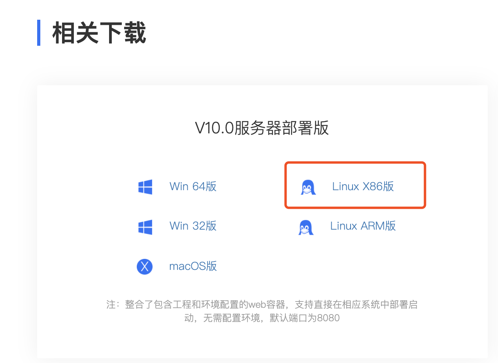
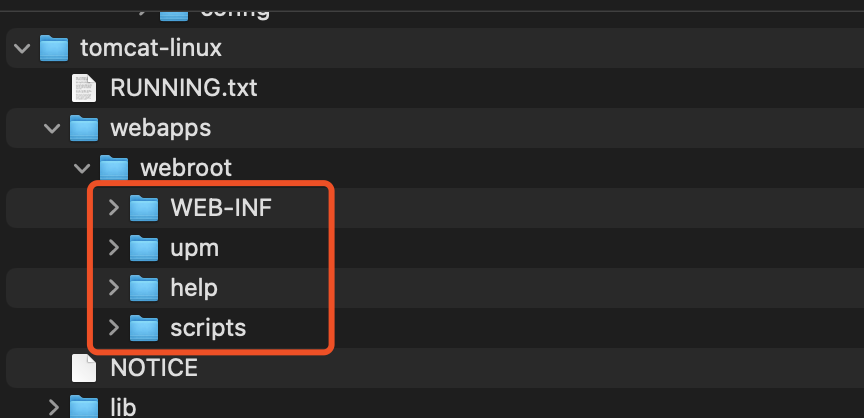
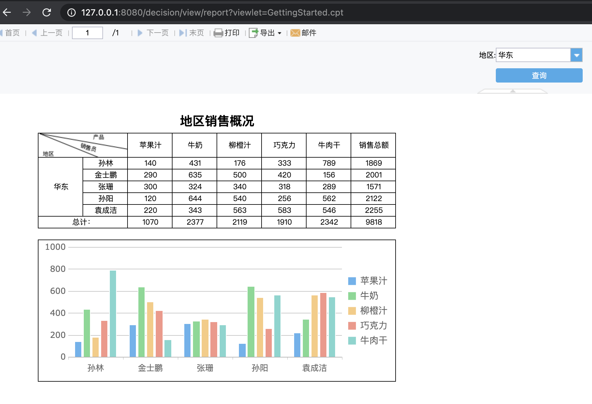

# fine-report

> 帆软报表10.0嵌入集成，基于spring boot，可扩展 spring cloud。无侵入，高扩展。

1. 本质是springboot 嵌入式tomcat提供壳子启动以外部资源启动。
2. 可以自行更新帆软最新lib，自行更新数据源说使用jar
3. 通过类加载的顺序，自定义功能生成classes文件之后引入

## 配置

### 准备帆软服务器文件

帆软官网[下载](https://www.finereport.com/product/download)指定系统类型的服务器部署版的包。



### 帆软文件路径

​	**准备帆软文件的`DOC_BASE`路径，例如设置为/data/fr10-web**

​    下载最新版本finereport10，将`webapps/webroot/`下所有文件和文件夹复制都**`/data/fr10-web/`** 下




## 部署

### 打包

```shell
mvn clean package -DskipTest=true
```

### 运行

```shell
java -Xmx1g -Xms1g \
-DDOC_BASE='/data/fr10-web' \
-Dloader.path="BOOT-INF/classes/,file:/data/fr10-web/WEB-INF/classes,file:/data/fr10-web/WEB-INF/lib,BOOT-INF/lib/,/Library/Java/JavaVirtualMachines/jdk1.8.0_221.jdk/Contents/Home/lib/tools.jar" \
-jar hdsp-fr-server.jar  > ./logs/hdsp-fr-server.log 2>&1 &
```


**重点：**

`loader.path` ：` loader.path`为spring boot loader的lib包加载目录，同时⚠️**loader.path的顺序为加载类的顺序**。指定值中

1. `BOOT-INF/classes/`, hdsp-fr-server.jar包内`Spring-Boot-Classes`目录。
2. `BOOT-INF/lib/`，hdsp-fr-server.jar包内`BOOT-INF/lib/`目录。
3. `/Library/Java/JavaVirtualMachines/jdk1.8.0_221.jdk/Contents/Home/lib/tools.jar` 这个修改，修改为服务器的java tools包的路径，在`$JAVA_HOME/lib/tools.jar`下，需要指定为绝对路径。
4. 帆软的jar，指定绝对目录，在DOC_BASE 下 lib。例如`DOC_BASE` 为`/data/fr10-web `,指定为`file:/data/fr10-web/WEB-INF/lib`。
5. 帆软重载的classes，指定绝对目录，在DOC_BASE 下classes。例如`DOC_BASE` 为`/data/fr10-web`，指定为`file:/data/fr10-web/WEB-INF/classes`。

### 运行

* 浏览器访问：http://127.0.0.1:8080
* 帆软地址：`http://127.0.0.1:8080/decision`。


* 访问帆软模板：`http://127.0.0.1:8080/decision/view/report?viewlet=GettingStarted.cpt`，其中`GettingStarted.cpt`是帆软默认提供的。




## 实现

### 内置tomcat定制化

第一种方式是通过通用的 Web 容器工厂 ConfigurableServletWebServerFactory，来定制一些 Web 容器通用的参数：

```java

@Component
public class MyGeneralCustomizer implements
  WebServerFactoryCustomizer<ConfigurableServletWebServerFactory> {
  
    public void customize(ConfigurableServletWebServerFactory factory) {
        factory.setPort(8081);
        factory.setContextPath("/hello");
     }
}
```

第二种方式是通过特定 Web 容器的工厂比如 TomcatServletWebServerFactory 来进一步定制。下面的例子里，我们给 Tomcat 增加一个 Valve，这个 Valve 的功能是向请求头里添加 traceid，用于分布式追踪。

```java

class TraceValve extends ValveBase {
    @Override
    public void invoke(Request request, Response response) throws IOException, ServletException {

        request.getCoyoteRequest().getMimeHeaders().
        addValue("traceid").setString("1234xxxxabcd");

        Valve next = getNext();
        if (null == next) {
            return;
        }

        next.invoke(request, response);
    }
}
```

跟第一种方式类似，再添加一个定制器，代码如下：

```java

@Component
public class MyTomcatCustomizer implements
        WebServerFactoryCustomizer<TomcatServletWebServerFactory> {

    @Override
    public void customize(TomcatServletWebServerFactory factory) {
        factory.setPort(8081);
        factory.setContextPath("/hello");
        factory.addEngineValves(new TraceValve() );

    }
}
```

### PropertiesLauncher

springboot 提供的类加载机制。可以通过这个扩展加载方式。指定外部jar的加载方式。打包时指定repackage 会默认选择PropertiesLauncher。

### 核心代码

```java
    public static class FineReportWebServerFactoryCustomizer implements WebServerFactoryCustomizer<TomcatServletWebServerFactory>, Ordered {

        @Override
        public void customize(TomcatServletWebServerFactory factory) {
            String docBase = System.getProperty("DOC_BASE");
            if (StringUtils.isEmpty(docBase)) {
                throw new IllegalArgumentException("DOC_BASE system property can't empty");
            }
            File file = new File(docBase);
            if (!file.exists()) {
                boolean mkdirsStatus = file.mkdirs();
            }
            if (file.exists() && file.isDirectory()) {
                String env = file.getAbsoluteFile().getPath();
                factory.setDocumentRoot(file);
            } else {
                throw new IllegalArgumentException("Fine webapp dir [env] not found");
            }
            // 加载帆软Web
            factory.getTomcatContextCustomizers()
                    .add(context -> context.addApplicationListener("com.fr.startup.FineServletContextListener"));
        }

        @Override
        public int getOrder() {
            return 0;
        }
    }
```


## 其它

### spring不支持加载超大jar包(了解就好)

​	自己打包Spring boot项目依赖了第三方的fine-third jar包过大，导致启动后报错Caused by: java.lang.IllegalStateException: Zip64 archives are not supported.

#### 方式一

> 将一个jar拆分为多个jar，使用 jar -xf   解压jar 后拆解，使用jar -cf 压缩jar。

#### 方式二

Spring boot 2.2.x的版本进行了修复。可以将spring-boot-loader打包插件的版本提升到 2.2.x以上

```pom
<dependencyManagement>
    <dependencies>
        <dependency>
            <groupId>org.springframework.boot</groupId>
            <artifactId>spring-boot-maven-plugin</artifactId>
            <version>2.3.2.RELEASE</version>
        </dependency>
        <dependency>
            <groupId>org.springframework.boot</groupId>
            <artifactId>spring-boot-loader</artifactId>
            <version>2.3.2.RELEASE</version>
        </dependency>
    </dependencies>
</dependencyManagement>
```

## 问题

### 为什么要重置`src/main/webapp`目录到`env`？

这是因为创建`src/main/webapp`目录后，如果将帆软资源复制进去后，那么在打包的时候，则需要打成`war`包（通过`tomcat`部署）。

而重置`webapp`目录到`env`后，可以打包成`jar`包，帆软此时通过`env`目录来进行配置读取、模版解析、备份等。

也就是说，`env`目录相当于`tomcat`的`docBase`了。

